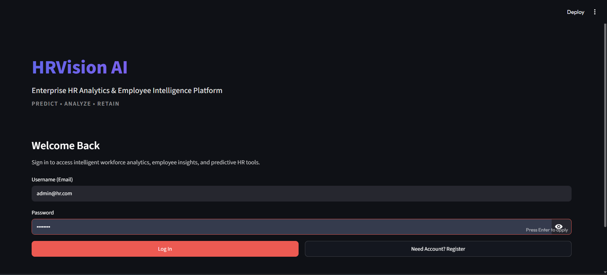
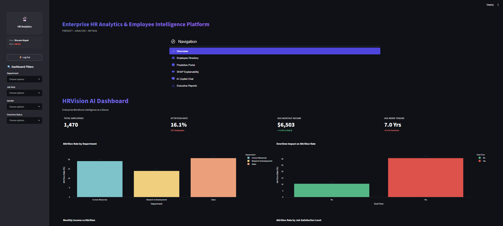
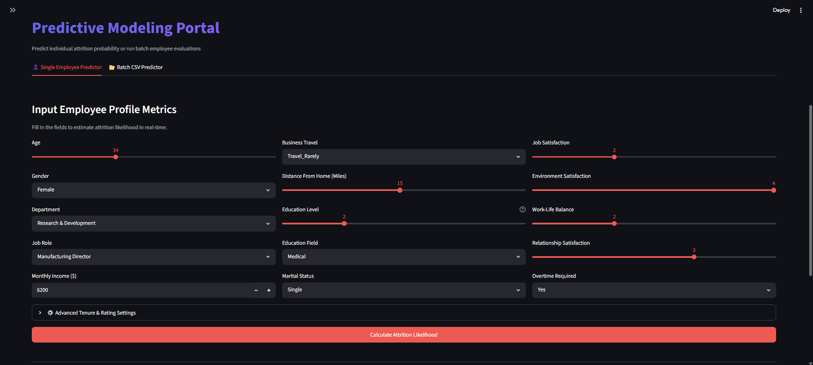
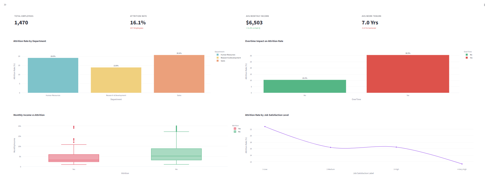
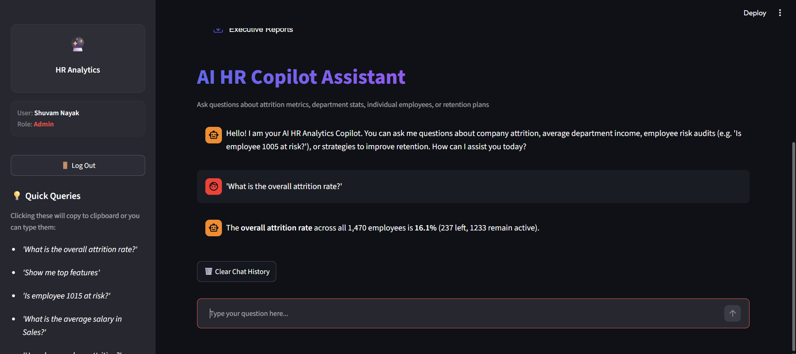
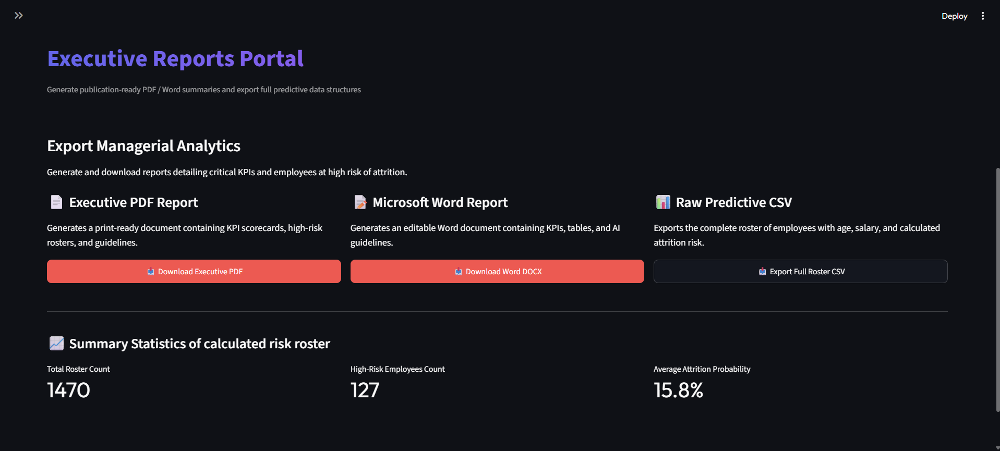

# HRVision AI

## Enterprise HR Analytics & Employee Intelligence Platform

**Predict • Analyze • Retain**

HRVision AI is an AI-powered Human Resource Analytics platform that helps organizations predict employee attrition, analyze workforce trends, and support data-driven HR decision-making using Machine Learning and interactive dashboards.

The platform combines predictive analytics, workforce analytics, bulk employee prediction, automated reporting, and AI-powered insights into a modern HR analytics solution suitable for enterprise environments.

---

# 📌 Project Overview

Employee attrition is one of the biggest challenges faced by organizations. HRVision AI enables HR professionals to identify employees at risk of leaving, analyze workforce behavior, and make proactive retention decisions using Machine Learning.

The application provides an interactive dashboard, employee attrition prediction, analytics, explainable AI, batch employee analysis, chatbot assistance, and professional report generation.

---

# 🎯 Objectives

- Predict employee attrition using Machine Learning.
- Analyze workforce trends through interactive dashboards.
- Identify high-risk employees.
- Support HR decision-making.
- Generate professional reports.
- Provide a modern HR analytics platform.

---

# ✨ Key Features

## 🔐 Authentication

- Secure Login System
- User Registration
- Session Management
- Admin Dashboard

## 📊 Interactive Dashboard

- Employee Statistics
- Attrition Rate
- Department Analysis
- Workforce KPIs
- Interactive Charts

## 🤖 Employee Attrition Prediction

- Single Employee Prediction
- Prediction Confidence
- Risk Classification
- HR Recommendations

## 📂 Bulk Employee Analysis

- Upload Employee CSV
- Batch Predictions
- Risk Summary
- Download Prediction Results

## 📈 Workforce Analytics

- Department Analysis
- Salary Distribution
- Age Distribution
- Gender Analysis
- Overtime Analysis
- Employee Demographics

## 🧠 Explainable AI

- Model Explainability
- Feature Contribution
- Prediction Interpretation

## 💬 AI Chatbot

- HR Analytics Assistant
- Employee Insights
- Interactive Support

## 📄 Reports

- PDF Reports
- Word Reports
- Excel Reports
- CSV Export

---

# 🛠 Technology Stack

## Frontend

- Streamlit
- HTML
- CSS

## Backend

- Python

## Machine Learning

- Scikit-learn
- Random Forest Classifier
- Pandas
- NumPy
- Joblib

## Database

- MongoDB
- JSON Local Storage

## Data Visualization

- Plotly
- Matplotlib

## Report Generation

- ReportLab
- python-docx
- OpenPyXL

## Development Tools

- Jupyter Notebook
- Visual Studio Code
- Git
- GitHub

---

# 🤖 Machine Learning Workflow

```text
IBM HR Analytics Dataset
        │
        ▼
Data Cleaning
        │
        ▼
Feature Engineering
        │
        ▼
Data Preprocessing
        │
        ▼
Random Forest Classifier
        │
        ▼
Prediction
        │
        ▼
Analytics Dashboard
        │
        ▼
HR Decision Support
```

---

# 📁 Project Structure

```text
HRVISION-AI
│
├── app
│   ├── assets
│   │   └── custom.css
│   │
│   ├── views
│   │   ├── admin.py
│   │   ├── chatbot_view.py
│   │   ├── dashboard.py
│   │   ├── employees.py
│   │   ├── explainability.py
│   │   ├── prediction.py
│   │   └── reports_view.py
│   │
│   ├── auth.py
│   ├── chatbot.py
│   ├── database.py
│   ├── reports.py
│   └── utils.py
│
├── data
│   ├── HR-Employee-Attrition.csv
│   └── local_db.json
│
├── models
│
├── notebooks
│   └── 01_EDA-checkpoint.ipynb
│
├── screenshots
│   ├── login.png
│   ├── dashboard.png
│   ├── prediction.png
│   ├── analytics.png
│   ├── chatbot.png
│   ├── reports.png
│   ├── admin.png
│   └── about.png
│
├── .gitignore
├── main.py
├── requirements.txt
└── README.md
```

---

# ⚙️ Installation

## Clone Repository

```bash
git clone https://github.com/yourusername/HRVISION-AI.git
```

## Navigate into Project

```bash
cd HRVISION-AI
```

## Create Virtual Environment

```bash
conda create -n hrvision python=3.12
conda activate hrvision
```

## Install Dependencies

```bash
pip install -r requirements.txt
```

## Run Application

```bash
streamlit run main.py
```

---

# 📊 Application Modules

- 🔐 Login & Authentication
- 👨‍💼 Admin Panel
- 📊 Dashboard
- 🤖 Employee Prediction
- 📂 Bulk Employee Prediction
- 🧠 Explainable AI
- 📈 Workforce Analytics
- 💬 AI Chatbot
- 📄 Reports

---

# 📂 Dataset

**IBM HR Analytics Employee Attrition Dataset**

The dataset contains employee demographic, organizational, and workplace-related information used to train the Machine Learning model for predicting employee attrition.

---

# 🧠 Machine Learning Model

### Algorithm

Random Forest Classifier

### Purpose

Predict whether an employee is likely to leave the organization based on HR-related attributes.

---

# 📷 Application Screenshots

## 🔐 Login Page



---

## 📊 Dashboard



---

## 🤖 Employee Prediction



---

## 📈 Analytics



---

## 💬 AI Chatbot



---

## 📄 Reports



---

## 👨‍💼 Admin Panel


---

## ℹ️ About


---

# 🚀 Future Enhancements

- React + FastAPI Version
- Explainable AI using SHAP
- REST API Integration
- Cloud Deployment
- Deep Learning Models
- Advanced Workforce Forecasting
- Mobile Responsive UI

---

# 👨‍💻 Developer

## Shuvam Nayak

**Aspiring Machine Learning Engineer | Data Analyst | Python Developer**

---

# 📜 License

This project is developed for educational, research, and portfolio purposes.

---

# 🙏 Acknowledgements

- IBM HR Analytics Employee Attrition Dataset
- Scikit-learn
- Streamlit
- Plotly
- MongoDB
- Python Community

---

## ⭐ Support

If you found this project useful, consider giving this repository a **Star ⭐** on GitHub.

Thank you for visiting **HRVision AI**.